# PaperSage

**A from-scratch, GPU-accelerated Retrieval-Augmented Generation (RAG) pipeline for question-answering over PDFs.**


> ℹ️ *This README was generated by deep-reading the actual project files (`requirements.txt`, `.gitignore`, `Rag_pipeline_mine.ipynb` — all 62 cells) rather than inferred from the project name alone. Sections that don't apply to this project's current scope (auth, Docker, CI/CD, a deployed API) are explicitly marked "Not applicable" rather than fabricated — see [Documentation Gaps](#-documentation-gaps--honest-assessment). Updated after fixing the `requirements.txt` gaps, the empty-context LLM call, and the ingestion duplication bug.*

---

## Executive Summary

PaperSage ingests PDF documents, splits them into overlapping text chunks, embeds each chunk locally with a CUDA-accelerated sentence-transformer model, and persists the vectors in a local ChromaDB store. At query time, it embeds the user's question into the same vector space, retrieves the most semantically similar chunks via cosine similarity with a score threshold, and hands that context to a Groq-hosted LLM to generate a grounded answer. Every pipeline stage — loading, chunking, embedding, storage, retrieval, generation — is a small hand-written class rather than a pre-built LangChain abstraction, making this an explicitly *inspectable*, learning-oriented RAG implementation rather than a framework black box.

---

## 📸 Demo — Real Output

Query: `"What is RAG?"` → routed through the full pipeline (retrieval → context assembly → Groq `openai/gpt-oss-20b` generation), ~1.6s end-to-end.

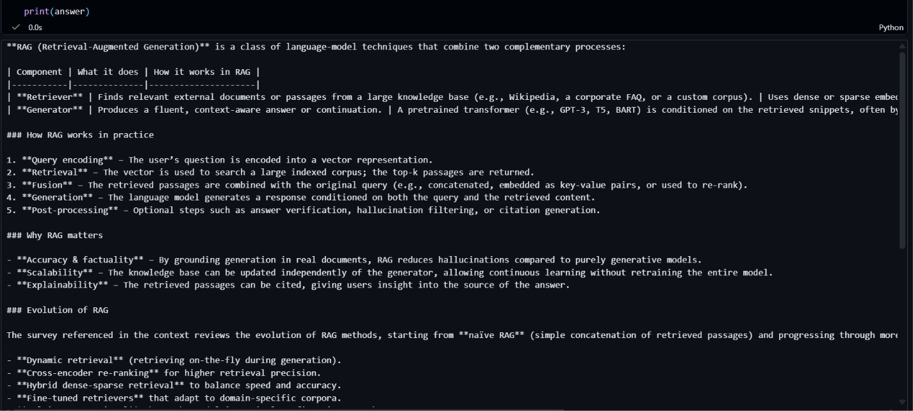
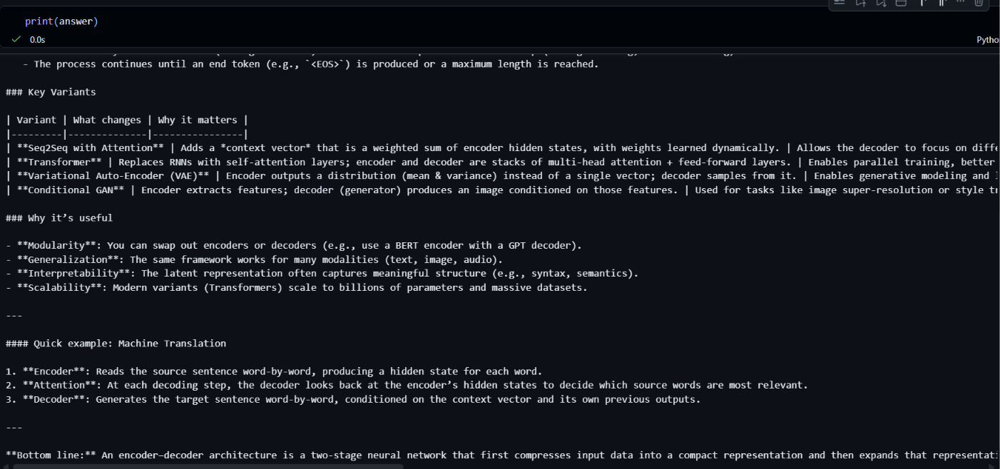

---

## Problem Statement

Pretrained LLMs answer from what they memorized during training — they can't cite *your* documents, and they hallucinate when asked about content they never saw. Feeding an entire PDF corpus into a prompt doesn't scale past a few pages. PaperSage solves this by retrieving only the handful of chunks relevant to a specific question and grounding generation in that retrieved context.

## Solution Overview

A six-stage local pipeline: **Load → Chunk → Embed → Store → Retrieve → Generate**, built and validated incrementally inside a single Jupyter notebook, with each stage backed by a small, purpose-built Python class.

## Key Features

| Feature | Status | Notes |
|---|---|---|
| Multi-format ingestion | ✅ | `.txt` via `TextLoader`, `.pdf` via `PyPDFLoader` (production path) and `PyMuPDFLoader` (evaluated alternative) |
| Recursive chunking | ✅ | 500-char chunks, 50-char overlap |
| GPU-accelerated embeddings | ✅ | `all-MiniLM-L6-v2` on CUDA when available, falls back to CPU |
| Local persistent vector store | ✅ | ChromaDB `PersistentClient`, on-disk HNSW index |
| Threshold-filtered retrieval | ✅ | Cosine similarity (`1 - distance`), configurable `top_k` / `score_threshold` |
| Grounded generation | ✅ | Groq-hosted `openai/gpt-oss-20b` via `langchain-groq` |
| REST API | ❌ | Not built — notebook-only today |
| Auth | ❌ | Not applicable — single-user local notebook |
| Automated tests | ❌ | None found — see gaps |

---

## 🏗️ Overall Architecture

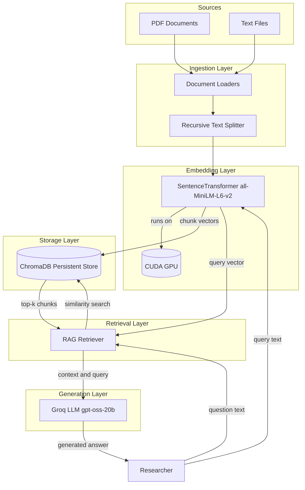

## 🏗️ System Architecture

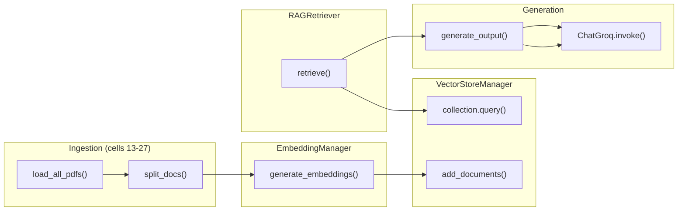

---

## 🧰 Technology Stack — Complete Breakdown

> Every dependency actually found in `requirements.txt`, plus imports found in the notebook that are missing from it (flagged below).

### RAG Orchestration

| Technology | Version | Category | Purpose in Project | Why Chosen | Key Features Used |
|---|---|---|---|---|---|
| langchain | 1.4.0 | Core abstraction | Provides the `Document` class (`page_content` + `metadata`) used as the common data structure across loaders, splitter, and vector store | Ecosystem of pre-built loaders/splitters instead of hand-rolled PDF parsing | `Document` schema |
| langchain-community | 0.4.2 | Document Loaders | `TextLoader`, `PyPDFLoader`, `PyMuPDFLoader` — used to compare two PDF parsing backends | Side-by-side evaluation of extraction quality before picking a production loader | `.load()` on each loader |
| langchain-text-splitters | 1.1.2 | Chunking | `RecursiveCharacterTextSplitter` breaks documents into 500-char chunks, 50-char overlap | Recursive splitting respects paragraph/sentence boundaries better than fixed-width slicing | `split_documents()` |
| langchain-groq | 1.1.3 | Chat model wrapper | `ChatGroq` wraps Groq's chat-completions API for generation | Groq's LPU hardware gives sub-second inference even on 20B-parameter models | `.invoke(prompt)`, `.content` |

### Embeddings

| Technology | Version | Category | Purpose | Why Chosen | Key Features Used |
|---|---|---|---|---|---|
| sentence-transformers | 6.0.1 | Embedding model | Encodes chunks and queries into 384-dim vectors via `all-MiniLM-L6-v2` | Small, fast, well-benchmarked general-purpose embedder; runs locally instead of a per-call API | `SentenceTransformer.encode()`, `.device`, `.max_seq_length`, `.get_embedding_dimension()` |
| torch | 2.11.0 (`+cu128` build) | Tensor runtime | Backs the embedding model's forward pass; GPU-accelerated when CUDA is available | Explicitly reinstalled with the CUDA 12.8 wheel to move embedding off CPU (see [Troubleshooting](#-troubleshooting-guide)) | `torch.cuda.is_available()`, device placement |
| torchvision / torchaudio | 0.26.0 / 2.11.0 | Companions to torch | Installed alongside torch for CUDA wheel consistency | Standard PyTorch CUDA install trio | — |

### Document Ingestion

| Technology | Version | Category | Purpose | Why Chosen | Key Features Used |
|---|---|---|---|---|---|
| pypdf | 6.18.1 | PDF parsing (backend A) | Powers `PyPDFLoader`, the loader actually used in `load_all_pdfs()` | Simple, dependency-light, default LangChain PDF loader | Page-by-page text extraction |
| pymupdf | `>=1.24.0` | PDF parsing (backend B) | Powers `PyMuPDFLoader`, evaluated in cells 10–11 as an alternative extractor | Faster, more layout-aware extraction than pypdf; kept in the project even though `load_all_pdfs()` currently uses pypdf | Page-by-page text extraction |

### Vector Store

| Technology | Version | Category | Purpose | Why Chosen | Key Features Used |
|---|---|---|---|---|---|
| chromadb | 1.5.9 | Vector database | `PersistentClient` stores embeddings + documents + metadata on disk (`data/vectorstore/`) and serves top-k similarity queries | Zero-infrastructure, file-based vector DB — no server process needed for a single-user pipeline | `PersistentClient`, `get_or_create_collection()`, `.add()`, `.query()` |

### Utilities

| Technology | Version | Category | Purpose | Why Chosen | Key Features Used |
|---|---|---|---|---|---|
| python-dotenv | 1.2.3 | Config | Loads `GROQ_API_KEY` (and two unused keys) from `.env` | Keeps secrets out of source control | `os.getenv()` |
| numpy | 2.5.3 | Numeric backend | Underlies embedding arrays; upgraded specifically to fix a Windows `longdouble` overflow bug (see Troubleshooting) | Required transitively by torch/sentence-transformers | Array ops, `.tolist()` before writing to Chroma |
| scikit-learn | 1.9.1 | Similarity utilities | Present for `sklearn.metrics.pairwise.cosine_similarity` (cell 45) | Import exists in the notebook so it's now correctly declared | Not actually called — see note below |

> ✅ **Fixed:** `langchain-groq==1.1.3` and `scikit-learn==1.9.1` are now pinned in `requirements.txt` — a clean install on another machine no longer breaks at `from langchain_groq import ChatGroq`. `langchain-openai`, `openai`, and `tiktoken` were removed since nothing in the notebook imports them.
>
> ⚠️ **Still true:** the `scikit-learn` import (cell 45) is present but never actually called — `RAGRetriever` computes similarity manually as `1 - distance` instead. Kept in `requirements.txt` since the import exists in code; worth either using the function or dropping the import.

---

## 🔄 Request Lifecycle

### Path 1 — Ingestion (write path)

```
1. USER ACTION
   └── Researcher runs load_all_pdfs()  [cell 16]
       → Iterates data/pdfs/*.pdf
       → Each file: PyPDFLoader(pdf_path).load()
       → Prints "Total number of documents loaded" / "pages loaded"

2. CHUNKING
   └── split_docs(all_pdf_documents)  [cell 25]
       → RecursiveCharacterTextSplitter(chunk_size=500, chunk_overlap=50)
       → .split_documents(...) → list[Document] (320 chunks in the verified run)

3. EMBEDDING
   └── texts = [doc.page_content for doc in chunks]
       → embedding_manager.generate_embeddings(texts)  [EmbeddingManager, cell 30]
       → SentenceTransformer.encode(texts, show_progress_bar=True) on GPU when available
       → Returns a (320, 384) numpy array

4. STORAGE
   └── vector_store.add_documents(chunks, embedding)  [VectorStoreManager, cell 36]
       → Per chunk: doc_id = f"doc_{sha256(chunk.page_content)}"  (deterministic content hash)
       → metadata = {...source/page fields..., doc_index, content_length}
       → embedding.tolist() (Chroma needs JSON-serializable input)
       → self.collection.upsert(ids, metadatas, documents, embeddings)  — called once, after the loop
         → writes into ChromaDB's on-disk HNSW index at data/vectorstore/

5. CONFIRMATION
   └── Prints "Added N documents... Total documents in the collection after addition: N"
```

✅ **Fixed:** IDs are now `sha256` hashes of chunk content instead of random `uuid4()`s, and the write is a single `collection.upsert()` call after the loop instead of `collection.add()` called once per chunk inside it. Re-running ingestion on the same PDFs now overwrites existing entries instead of duplicating them (this is what caused the 320 → 642 document bug hit during development) — and the loop no longer re-writes every earlier chunk on every iteration.

### Path 2 — Query (read + generate path)

```
1. USER ACTION
   └── generate_output("What is RAG?", rag_retriever, llm, top_k=3)  [cell 57]

2. RETRIEVAL
   └── rag_retriever.retrieve(query, top_k)  [RAGRetriever.retrieve, cell 47]
       → embedding_manager.generate_embeddings([query])[0]
         (same embedding space as ingestion — required for meaningful similarity)
       → self.vector_store.collection.query(query_embeddings=[...], n_results=top_k)
         (ChromaDB approximate-nearest-neighbor search over the HNSW index)
       → For each candidate: similarity_score = 1 - distance
       → Kept only if similarity_score >= score_threshold (default 0.5)
       → Returns list[{id, metadata, document, distance, similarity_score, rank}]

3. CONTEXT ASSEMBLY
   └── context = "\n".join(doc["document"] for doc in results) if results else ""
       ✅ if nothing clears the threshold, generate_output() now returns immediately
       with a "no relevant documents" message instead of calling the LLM

4. PROMPT CONSTRUCTION
   └── f-string template:
       "use given context to generate the answer for the query
        Context: {context}
        Query: {query}"

5. GENERATION
   └── llm.invoke(prompt)  [ChatGroq]
       → LangChain wraps the bare string into a single-turn message list internally
         before it reaches Groq's actual chat-completions endpoint
       → Model: openai/gpt-oss-20b (Groq-hosted)
       → Returns an AIMessage

6. RESPONSE
   └── return response.content  → plain-text generated answer
```

⚠️ **Error path hit during development:** pointing `model` at a non-generative Groq model (`meta-llama/llama-prompt-guard-2-22m`, a prompt-injection *classifier*) doesn't raise an exception — `response.content` silently becomes a confidence-score float instead of text. No validation currently guards against a misconfigured model name.

---

## 🌊 Data Flow

### Ingestion

```
Raw PDF bytes (data/pdfs/*.pdf)
  → PyPDFLoader parses per-page text → Document objects (page_content + metadata: source, page)
  → RecursiveCharacterTextSplitter slices each Document into ~500-char chunks
    (50-char overlap preserves context across chunk boundaries) → list[Document]
  → SentenceTransformer.encode() converts chunk text → 384-dim float32 vectors
    (batched, GPU-resident during compute)
  → VectorStoreManager.add_documents() converts vectors to plain lists (.tolist())
    and writes {id, embedding, metadata, document} into ChromaDB's on-disk HNSW index
```

### Query

```
Raw query string
  → embedded via the same SentenceTransformer instance (same vector space as stored chunks)
  → ChromaDB HNSW approximate-nearest-neighbor search → top_k candidates ranked by distance
  → distance-to-similarity conversion (1 - distance) + threshold filter narrows candidates
  → surviving chunks' raw text newline-joined into a single context block
  → context + query interpolated into the prompt template
  → sent to Groq's hosted LLM, which generates a response grounded in that context
  → response.content returned to the caller as plain text
```

No caching layer, no request queue, no persistence of past Q&A turns — every call recomputes retrieval fresh (see [Roadmap](#-future-roadmap)).

---

<details>
<summary>📐 UML Diagrams — Full Suite</summary>

### 1. Use Case Diagram

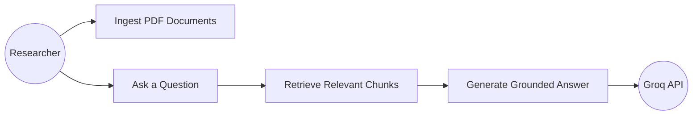

### 2. Class Diagram

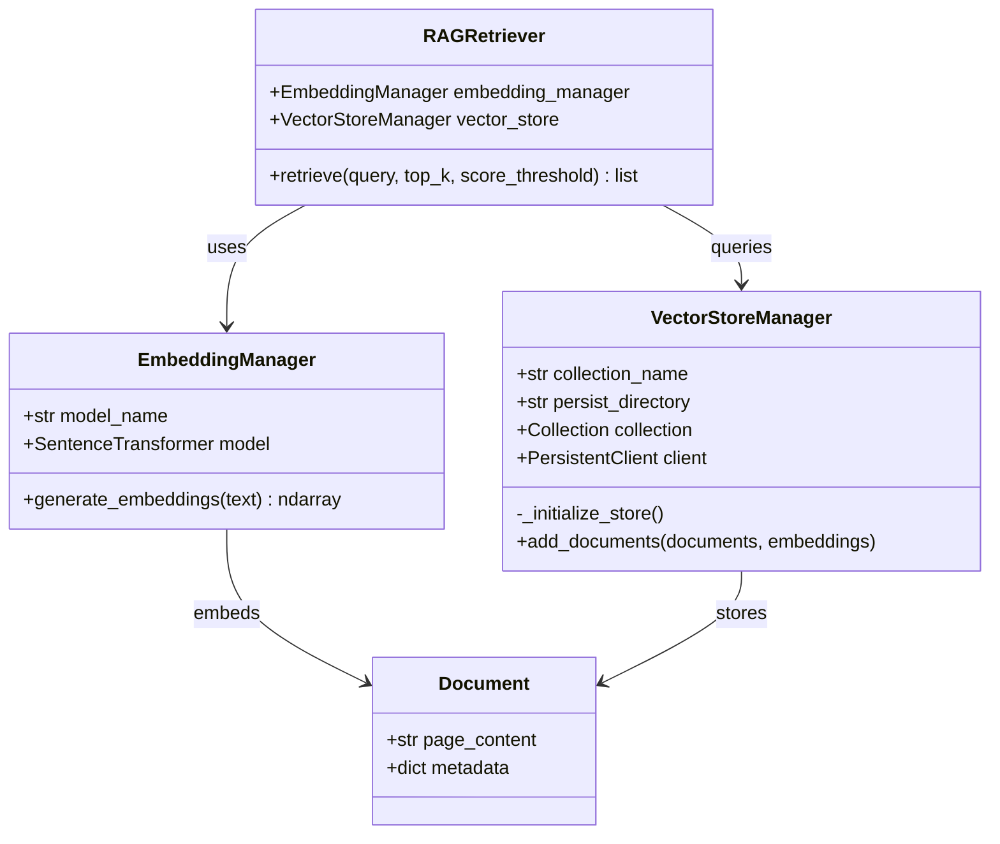

### 3. Sequence Diagram

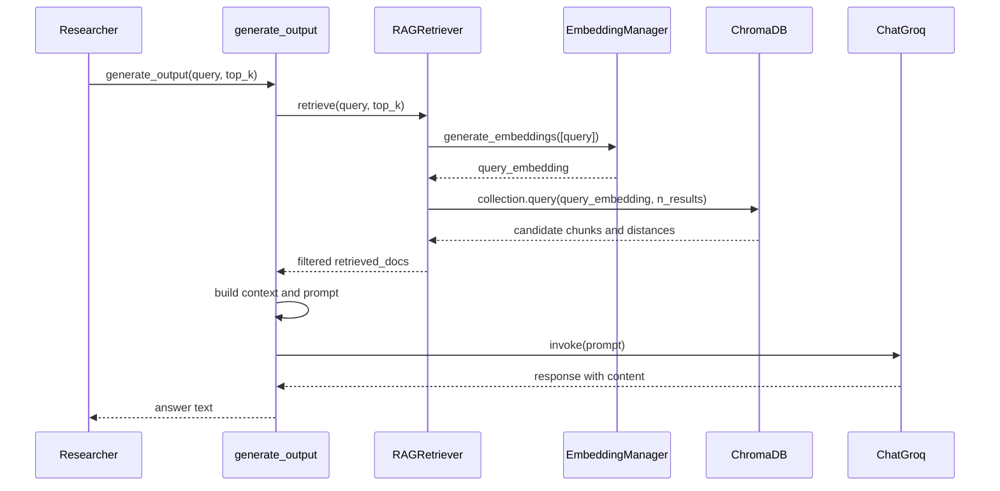

### 4. Collaboration Diagram

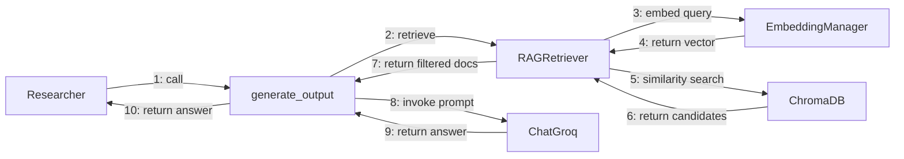

### 5. Activity Diagram — Ingestion Workflow

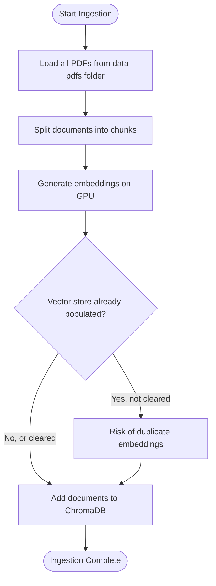

### 6. State Diagram — Chunk Lifecycle

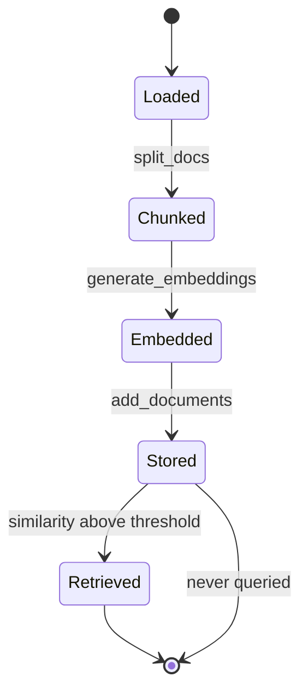

### 7. Component Diagram

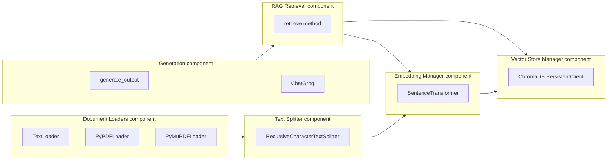

### 8. Deployment Diagram

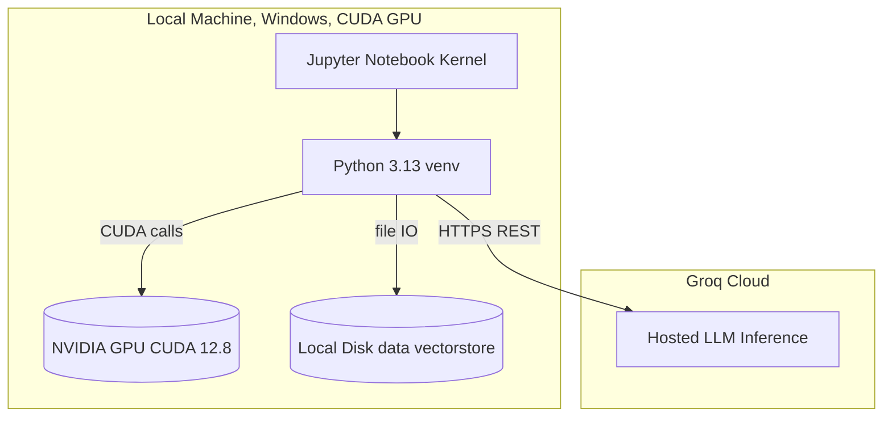

> No server, container, or cloud deployment exists for this project today — it runs entirely on the local dev machine. This diagram reflects that reality rather than a fabricated production topology.

### 9. Package Diagram

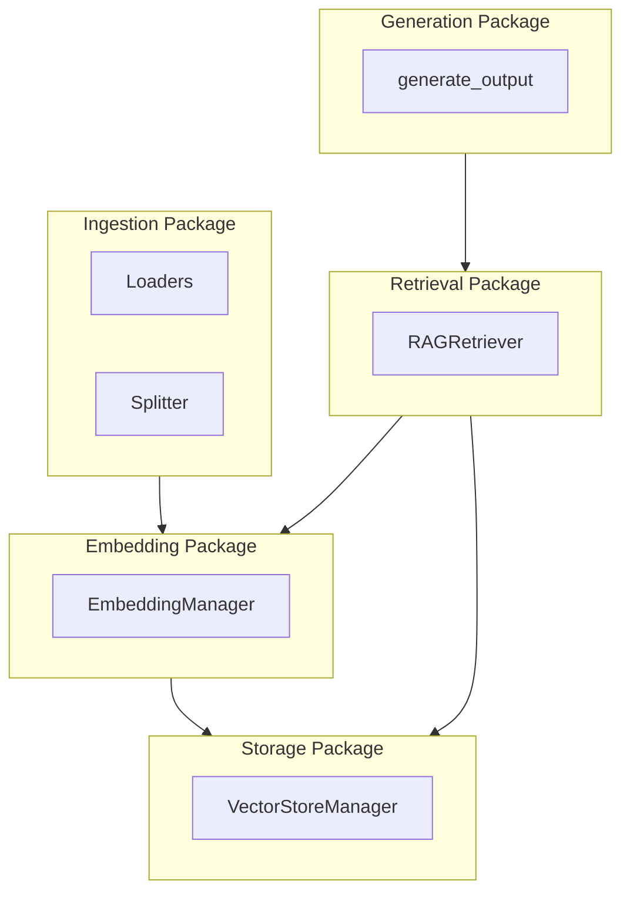

> A swimlane diagram was intentionally omitted — this project has a single human actor (the researcher) plus one external API (Groq); a swimlane wouldn't add information over the sequence diagram above.

</details>

<details>
<summary>📊 Data Flow Diagrams (L0 + L1)</summary>

### DFD Level 0 — Context Diagram

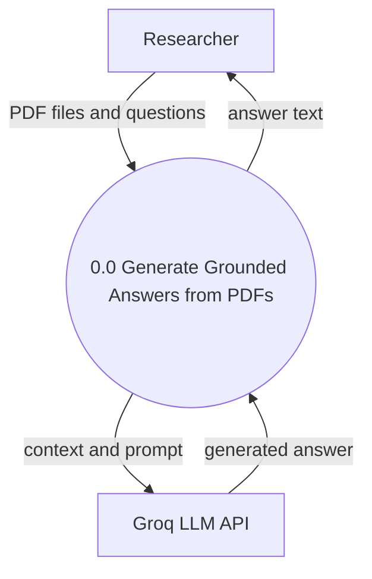

### DFD Level 1 — System Diagram

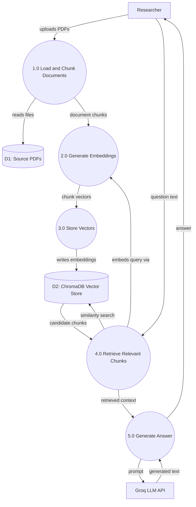

</details>

---

## 📁 Folder Structure

```
paper_sage/
├── .venv/                     # Python 3.13 virtual environment (uv-managed, gitignored)
├── .env                       # API keys — gitignored (see Environment Variables below)
├── .gitignore
├── requirements.txt            # Pinned dependencies
├── RAG_pipeline.ipynb          # Earlier/reference version of the notebook
├── Rag_pipeline_mine.ipynb     # Active working notebook — the pipeline documented here
└── data/
    ├── pdfs/                   # Source PDFs ingested by the pipeline
    │   ├── NIPS-2017-attention-is-all-you-need-Paper.pdf
    │   └── research2.pdf
    ├── Python is a high-level, interpreted.txt   # Sample plain-text ingestion source
    └── vectorstore/             # ChromaDB persistent store (gitignored, regenerable)
        └── <collection-uuid>/   # HNSW index: data_level0.bin, header.bin, link_lists.bin, length.bin, index_metadata.pickle
```

---

## Prerequisites

- Python 3.13
- [`uv`](https://github.com/astral-sh/uv) for environment/package management
- NVIDIA GPU + CUDA 12.8 drivers (optional — falls back to CPU automatically, just slower)
- A [Groq API key](https://console.groq.com)

## Installation

```bash
git clone https://github.com/KARTHIKAKRISHNA123/paper-sage.git
cd paper-sage

uv venv
uv pip install -r requirements.txt

# GPU-accelerated torch (CUDA 12.8 build):
uv pip uninstall torch torchvision torchaudio -y
uv pip install torch torchvision torchaudio --index-url https://download.pytorch.org/whl/cu128
```

## Environment Variables

| Variable | Required | Used By | Notes |
|---|---|---|---|
| `GROQ_API_KEY` | ✅ Yes | `ChatGroq` (cell 55) | Powers the generation step |
| `OPEN_AI_API_KEY` | ❌ No | — | Present in `.env`, not referenced by any current cell |
| `GEMINI_API_KEY` | ❌ No | — | Present in `.env`, not referenced by any current cell |

## Configuration Guide

Real, code-level configurable knobs (no external config file exists — these are function/constructor parameters):

| Knob | Location | Default | Effect |
|---|---|---|---|
| `model_name` | `EmbeddingManager.__init__` | `all-MiniLM-L6-v2` | Swaps the embedding model |
| `chunk_size` / `chunk_overlap` | `split_docs()` | `500` / `50` | Controls chunk granularity vs. context preservation |
| `top_k` | `RAGRetriever.retrieve()` | `5` | How many candidates ChromaDB returns before threshold filtering |
| `score_threshold` | `RAGRetriever.retrieve()` | `0.5` | Minimum similarity to keep a candidate |
| `model` | `ChatGroq(...)` | `openai/gpt-oss-20b` | Which Groq-hosted model generates the answer |

## Usage

```python
# 1. Ingest (run once, or after adding new PDFs)
all_pdf_documents = load_all_pdfs()
chunks = split_docs(all_pdf_documents)
embedding_manager = EmbeddingManager()
vector_store = VectorStoreManager()
texts = [doc.page_content for doc in chunks]
embeddings = embedding_manager.generate_embeddings(texts)
vector_store.add_documents(chunks, embeddings)

# 2. Query
rag_retriever = RAGRetriever(embedding_manager, vector_store)
llm = ChatGroq(groq_api_key=os.getenv("GROQ_API_KEY"), model="openai/gpt-oss-20b", temperature=0.1)
answer = generate_output("What is RAG?", rag_retriever, llm, top_k=3)
print(answer)
```

---

## Database Schema

Not a relational schema — a single flat ChromaDB collection named `pdf_documents`:

| Field | Type | Description |
|---|---|---|
| `id` | string | `doc_{sha256}` — deterministic hash of chunk content; stable across ingestion reruns |
| `embedding` | float[384] | Output of `all-MiniLM-L6-v2` |
| `document` | string | The chunk's raw text |
| `metadata.source` | string | Original file path (from the loader) |
| `metadata.page` | int | Page number (from `PyPDFLoader`) |
| `metadata.doc_index` | int | Position in the ingestion batch |
| `metadata.content_length` | int | `len(chunk.page_content)` |

## Authentication

**Not applicable.** This is a single-user local notebook with one outbound authenticated call (to Groq, via API key). No login, sessions, or user accounts exist.

## State Management

No UI state to manage. The two real forms of "state" here:
1. **Persisted state** — the ChromaDB collection on disk (`data/vectorstore/`), which survives across notebook restarts.
2. **In-kernel state** — notebook variables (`llm`, `embedding_manager`, etc.) that only live for the current kernel session. A real bug surfaced from this during development: running cells out of order left `llm` bound to a non-chat model from an earlier cell, and `response.content` silently returned a stray float instead of raising an error — always verify with `print(type(llm))` after a kernel restart before trusting a generation result.

## ML Pipeline

- **Model:** `sentence-transformers/all-MiniLM-L6-v2` — used as a frozen, pretrained checkpoint. No fine-tuning occurs anywhere in this project.
- **Training:** None — this is an inference-only pipeline over a pretrained embedding model and a pretrained (Groq-hosted) LLM.
- **Dataset pipeline:** `data/pdfs/*.pdf` → `Document` objects → 500-char/50-overlap chunks. This chunking step *is* the dataset-prep stage.
- **Inference flow (embedding):** chunk text → `SentenceTransformer.encode()` → 384-dim vector.
- **Inference flow (generation):** context + query → prompt string → Groq `openai/gpt-oss-20b` → generated text.

## Results

See the [Demo](#-demo--real-output) section above — both screenshots show the pipeline's actual output for the query *"What is RAG?"*, generated in ~1.6 seconds end-to-end (retrieval + Groq generation).

---

## Security Considerations

- ✅ `.env` is correctly gitignored — verified directly against the project's `.gitignore`.
- ⚠️ `.env` currently holds `OPEN_AI_API_KEY` and `GEMINI_API_KEY` alongside the one key actually used (`GROQ_API_KEY`) — unused keys are unnecessary exposed-secret surface; consider removing them if there's no near-term plan to use them.
- ⚠️ No sanitization on ingested PDF text before it's placed verbatim into the LLM prompt — if PDFs ever come from an untrusted source, this is a prompt-injection surface (a malicious PDF could contain instructions the LLM might follow).

## Performance Optimizations

- GPU-accelerated embedding generation (explicit `device="cuda"` check with CPU fallback).
- Groq's LPU-backed inference for low-latency generation (observed ~1.6s round trip).
- Chunk size/overlap tuned to 500/50 as a context-vs-recall balance.

## Scalability Design

Current design is intentionally single-user/local: ChromaDB's `PersistentClient` is file-based, not networked, so it does not support concurrent multi-user access. Scaling beyond one user/machine would require Chroma's client-server mode or a hosted vector DB (Pinecone, Qdrant Cloud, etc.) — see [Roadmap](#-future-roadmap).

## Deployment

**Local only.** No cloud deployment, container, or hosted service exists for this project — see [Installation](#installation) for the (only) supported setup path.

## Docker / CI-CD / Testing

**Not applicable — none of these exist in the project today.** No `Dockerfile`, no CI config, and no test files were found. Flagged honestly in [Documentation Gaps](#-documentation-gaps--honest-assessment) rather than fabricated.

## Error Handling Strategy

Grounded in the actual source:
- `VectorStoreManager.add_documents()` raises `ValueError` if `len(documents) != len(embeddings)`.
- `RAGRetriever.retrieve()` **prints** (doesn't raise) `"No documents found for the given query."` when nothing clears the threshold.
- `generate_output()` prints a warning on empty context and **returns immediately** without calling the LLM — no wasted API call on an empty-context request.

## Logging Strategy

`print()`-based only — no structured logging framework (e.g. `logging`, `structlog`) is used anywhere in the notebook.

---

## Engineering Decisions and Tradeoffs

- **Hand-rolled classes over LangChain's built-in `VectorStore`/`Retriever` abstractions** — trades convenience for full visibility into every pipeline step; explicitly a learning-oriented choice.
- **Manual `1 - distance` similarity instead of the imported (but unused) `sklearn.metrics.pairwise.cosine_similarity`** — relies on Chroma's own configured distance metric being cosine-compatible, rather than computing similarity independently.
- **Kept both `PyPDFLoader` and `PyMuPDFLoader` in the codebase** even though `load_all_pdfs()` only uses the former — likely intentional (keeping the alternative available for comparison), worth a one-line code comment.
- **Groq over OpenAI for generation** — free-tier friendly and very fast inference; no functional requirement forces this choice over OpenAI's API.

## 🗺️ Future Roadmap

- pytest coverage for `RAGRetriever`'s threshold-filtering logic.
- Externalize config (chunk size, `top_k`, model names) into a single config dict/YAML instead of scattered literals.
- Either call `sklearn.metrics.pairwise.cosine_similarity` where it's already imported, or drop the unused import.
- Optional: wrap the pipeline in a small CLI or FastAPI endpoint for reuse outside Jupyter.

> ✅ Already done: deterministic content-hash IDs + `upsert()` (idempotent re-ingestion), the empty-context guard clause in `generate_output()`, and the `requirements.txt` dependency cleanup.

---

## 🔧 Troubleshooting Guide

Real issues hit and fixed during development of this project:

| Symptom | Cause | Fix |
|---|---|---|
| `torch.cuda.is_available()` returns `False` | CPU-only torch wheel installed | `uv pip uninstall torch torchvision torchaudio -y`, then reinstall with `--index-url https://download.pytorch.org/whl/cu128` (uv silently no-ops on an unpinned reinstall unless you uninstall first) |
| `OverflowError: cannot convert longdouble infinity to integer` | Windows-specific numpy bug in `getlimits.py` | `uv pip install -U numpy` |
| `pymupdf==1.22.0` fails to build (`devenv.com` not found) | Old pymupdf version has no prebuilt Windows wheel, tries to compile via Visual Studio | Unpin to `pymupdf>=1.24.0` |
| ChromaDB document count doubles after rerun | `uuid4()` IDs aren't deterministic — reruns without clearing `data/vectorstore/` duplicate every embedding | ✅ Fixed in code — `add_documents()` now uses content-hash IDs + `upsert()`, so reruns overwrite instead of duplicate. (If you still hit a file lock deleting `data/vectorstore/` manually, restart the kernel first — Windows holds `chroma.sqlite3` open while the kernel runs.) |
| Notebook uses the wrong (CPU-only) venv | Jupyter kernel bound to a different `.venv` than the one being edited in the terminal | Check `sys.executable`, or look for a `+cu` suffix on the installed `torch-*.dist-info` folder |
| `llm.invoke()` returns a tiny float string instead of text | `model` pointed at a classifier (`meta-llama/llama-prompt-guard-2-22m`), not a chat model | `print(type(llm)); print(llm)` to confirm the model name before assuming the pipeline is broken |
| `404 model_not_found` on a previously-working model | Groq deprecates or enterprise-gates models over time | Check [console.groq.com/docs/models](https://console.groq.com/docs/models) for current availability |

## FAQ

**Why ChromaDB instead of FAISS or Pinecone?** Local, zero-infrastructure persistence was the priority for a single-user research notebook.

**Why Groq instead of OpenAI?** Fast inference and a generous free tier; no functional dependency on Groq specifically.

**Does this scale to a full research library?** Not without moving off a notebook and off the file-based ChromaDB client — the current design is intentionally minimal.

## Contributing

This is currently a personal learning project (part of [AIML_Knowledge_Base](https://github.com/KARTHIKAKRISHNA123/aiml-knowledge-base)). Issues and suggestions are welcome via GitHub Issues.

## License

MIT

## Credits and Acknowledgements

- [`sentence-transformers/all-MiniLM-L6-v2`](https://huggingface.co/sentence-transformers/all-MiniLM-L6-v2) for embeddings
- [ChromaDB](https://www.trychroma.com/), [Groq](https://groq.com/), [LangChain](https://www.langchain.com/)
- Sample corpus includes *"Attention Is All You Need"* (NIPS 2017)

---

## 📋 Documentation Gaps — Honest Assessment

Found by directly reading `requirements.txt`, `.gitignore`, and all 62 notebook cells — not inferred. Items below are what's *still* open; resolved issues are called out inline above (tech stack, request lifecycle, troubleshooting) rather than repeated here.

- **Unused import:** `sklearn.metrics.pairwise.cosine_similarity` is imported (cell 45) but never called — similarity is computed manually as `1 - distance` instead.
- **No tests, no CI/CD, no Dockerfile** — reasonable for the project's current notebook-only scope, but worth addressing if this grows into a reusable service.
- **No prompt-injection guard** on ingested PDF text before it enters the LLM prompt.

## Optional Architecture Improvements

- Add a thin `PipelineConfig` dataclass to collect the scattered `chunk_size`/`top_k`/`score_threshold`/model-name literals in one place.
- Replace `print()`-based status messages with Python's `logging` module for filterable, leveled output.
- Add a `RAGPipeline` orchestrator class that wires `EmbeddingManager` → `VectorStoreManager` → `RAGRetriever` → generation together, so `generate_output()` doesn't need three positional arguments passed in from notebook globals.